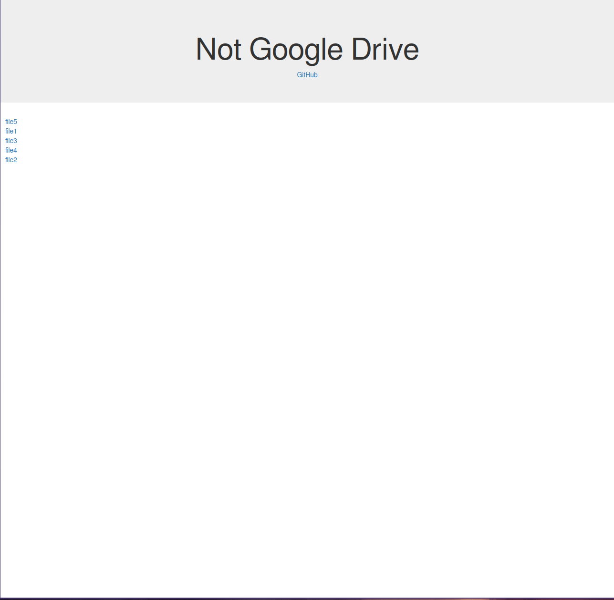

# Null Drive

## What is it?

Null Drive is a similar to python's [SimpleHTTPServer](https://docs.python.org/2/library/simplehttpserver.html) or Node JS's [http-server](https://github.com/http-party/http-server) in that they display serve the directory contents of the directory you launch them in. This is very convenient for local file sharing. I wanted something similar, but a bit more polished, with styling. Thus **Null Drive dynamically creates the html and css pages for the directory you would like to share.** 

## Example

`$ python ~/null-drive/serve.py --directory=~/Files --port=8000 --server=python`

## Dependencies 

- node.js http-server, available globally 
