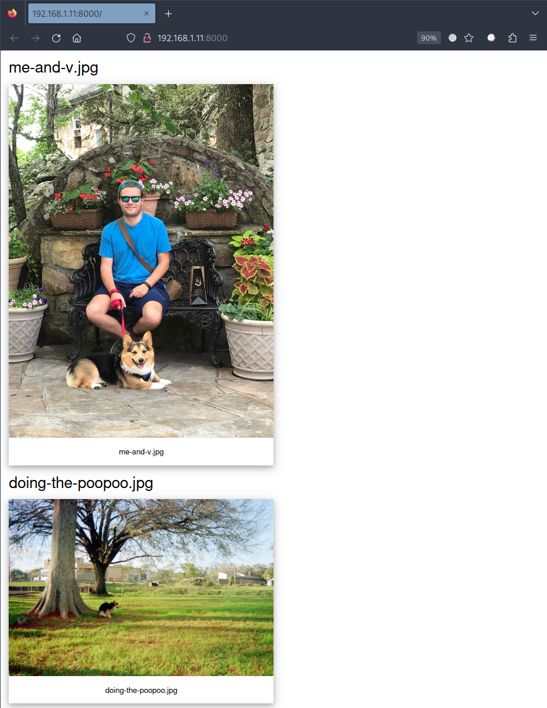

# Null Drive

**Currently In Development**

## What is it? 

Null Drive creates styled local directory server with a single command. Null Drive is a similar to python's [SimpleHTTPServer](https://docs.python.org/2/library/simplehttpserver.html) or Node JS's [http-server](https://github.com/http-party/http-server) in this way, but provides auto-generated HTML using `jinja2`. 

## Example

`$ python ~/null-drive/serve.py --directory=~/Pictures --port=8000 --server=python`

> Note: this looks unimpressive as is, but more advanced styling is forthcoming. 

## Dependencies 

- node.js http-server, available globally 
- python 3
